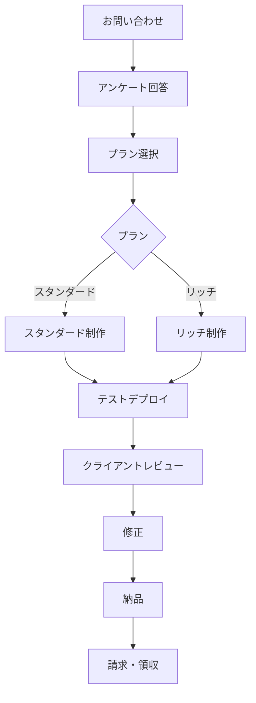

# LP制作サービス 統合ワークフローガイド

## 📋 目次
1. [全体フロー](#全体フロー)
2. [スタンダードプラン ワークフロー](#スタンダードプラン-ワークフロー)
3. [リッチプラン ワークフロー](#リッチプラン-ワークフロー)
4. [共通プロセス](#共通プロセス)
5. [自動化ツール](#自動化ツール)
6. [チェックリスト](#チェックリスト)

## 全体フロー



## スタンダードプラン ワークフロー

### 1. 初期設定（Day 1）
```bash
# クライアントフォルダ作成
mkdir -p clients/[client-name]/{questionnaire,specification,development/{src,assets},test-deployment,delivery}

# アンケート処理
node scripts/process-questionnaire.js clients/[client-name]
```

### 2. 仕様書作成（Day 1-2）
- テンプレート使用: `QUICK-START-TEMPLATE.md`
- 基本セクション構成
  - ヒーローセクション
  - 特徴（3つ）
  - 料金
  - お客様の声
  - FAQ
  - CTA

### 3. 開発（Day 2-4）
#### HTML構造
```html
<!DOCTYPE html>
<html lang="ja">
<head>
    <meta charset="UTF-8">
    <meta name="viewport" content="width=device-width, initial-scale=1.0">
    <title>[サービス名]</title>
    <!-- 基本的なSEO -->
    <meta name="description" content="[説明]">
</head>
<body>
    <!-- セクション構成 -->
</body>
</html>
```

#### CSS（レスポンシブ対応）
- モバイルファースト
- フレックスボックス/グリッド使用
- 基本的なアニメーション（フェードイン等）

### 4. テスト・納品（Day 5）
- Lighthouse検証（スコア80以上）
- クロスブラウザチェック
- 納品ファイル準備

## リッチプラン ワークフロー

### 1. 初期設定（Day 1）
スタンダードプランと同様 + 追加調査

### 2. 詳細仕様書作成（Day 1-3）
- 高度なインタラクション設計
- アニメーション仕様
- カスタム機能定義
- パフォーマンス目標設定

### 3. 開発（Day 3-7）
#### 高度な実装
```javascript
// GSAP アニメーション例
gsap.timeline()
    .from('.hero-title', {opacity: 0, y: 50, duration: 1})
    .from('.hero-subtitle', {opacity: 0, y: 30, duration: 0.8}, '-=0.5');
```

#### 追加機能
- スクロールトリガーアニメーション
- パララックス効果
- インタラクティブ要素
- 高度なフォーム処理

### 4. 最適化（Day 7-8）
- 画像最適化（WebP対応）
- コード圧縮
- キャッシュ戦略
- Lighthouse検証（スコア90以上）

### 5. テスト・納品（Day 9-10）
- 詳細なブラウザテスト
- パフォーマンステスト
- アクセシビリティチェック
- ドキュメント作成

## 共通プロセス

### アンケート処理
1. **受信**: Resend API経由でメール受信
2. **保存**: `questionnaire/original.txt`
3. **処理**: JSONフォーマットに変換
4. **通知**: 管理者にSlack/メール通知

### テストデプロイ
```bash
# 自動デプロイスクリプト
node scripts/process-questionnaire-with-deploy.js clients/[client-name]

# 手動デプロイ
cd clients/[client-name]/development
vercel --prod
```

### 品質チェック
- [ ] レスポンシブ対応（320px〜）
- [ ] SEO基本設定
- [ ] OGP画像設定
- [ ] ファビコン設定
- [ ] 404ページ
- [ ] フォーム動作確認
- [ ] SSL対応

## 自動化ツール

### 1. process-questionnaire.js
```javascript
// 使用方法
node scripts/process-questionnaire.js clients/[client-name]

// 機能
- アンケートJSON変換
- 仕様書テンプレート生成
- フォルダ構造作成
- dashboard更新
```

### 2. add-animations.js
```javascript
// GSAPアニメーション自動追加
node scripts/add-animations.js clients/[client-name]/development/src/index.html

// 追加される要素
- スクロールフェードイン
- ホバーエフェクト
- ローディングアニメーション
```

### 3. optimize-performance.js
```javascript
// パフォーマンス最適化
node scripts/optimize-performance.js clients/[client-name]

// 最適化項目
- 画像圧縮・WebP変換
- CSS/JS圧縮
- 不要コード削除
- キャッシュ設定
```

## チェックリスト

### 開発前チェック
- [ ] アンケート内容確認
- [ ] 参考サイト分析
- [ ] 素材受領確認
- [ ] 納期確認
- [ ] 技術要件確認

### 開発中チェック
- [ ] デザインカンプ承認
- [ ] レスポンシブ実装
- [ ] アニメーション実装
- [ ] フォーム実装
- [ ] SEO対策

### 納品前チェック
- [ ] 全ブラウザテスト
- [ ] モバイル実機テスト
- [ ] 表示速度測定
- [ ] リンクチェック
- [ ] フォーム送信テスト
- [ ] 最終承認取得

### 納品チェック
- [ ] ファイル整理
- [ ] ドキュメント作成
- [ ] サーバー情報提供
- [ ] 請求書発行
- [ ] アフターサポート説明

## タイムライン目安

### スタンダードプラン（5営業日）
- Day 1: アンケート分析・仕様書作成
- Day 2-3: デザイン・コーディング
- Day 4: テスト・修正
- Day 5: 納品・請求

### リッチプラン（10営業日）
- Day 1-2: 詳細分析・仕様書作成
- Day 3-4: デザイン作成・承認
- Day 5-7: 開発・実装
- Day 8-9: テスト・最適化
- Day 10: 納品・ドキュメント

## 緊急対応

### よくあるトラブル
1. **素材不足**: ストック画像で仮実装
2. **仕様変更**: 追加料金の相談
3. **納期遅延**: 早期連絡・リスケジュール
4. **技術的制限**: 代替案の提示

### エスカレーション
1. 技術的問題 → 開発チーム
2. デザイン問題 → デザインチーム
3. 契約・料金 → 営業担当
4. 緊急案件 → プロジェクトマネージャー

## 関連ドキュメント
- [PROJECT_OVERVIEW.md](./PROJECT_OVERVIEW.md) - プロジェクト概要
- [CLIENT_MANAGEMENT_GUIDE.md](./CLIENT_MANAGEMENT_GUIDE.md) - クライアント管理
- [QUICK-START-TEMPLATE.md](./QUICK-START-TEMPLATE.md) - クイックスタート
- [GSAP-BEST-PRACTICES.md](./GSAP-BEST-PRACTICES.md) - アニメーションガイド