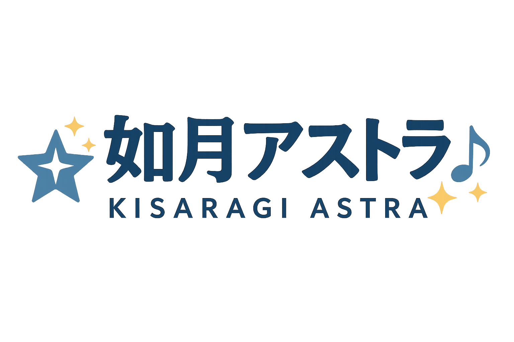

# ヒーローセクション改善実装

## 実装した改善内容

### 1. GSAPを活用した高度なアニメーション ✅

#### マスタータイムライン構造
- ロゴの3D回転登場（rotationY: 720度）
- タイプライター風テキスト演出
- ボタンの波動エフェクト（パルスアニメーション）
- キャラクターのグリッチ登場演出

#### 新規追加エフェクト
- **データストリーム背景**: 縦に流れる光のライン
- **フローティング音符**: ランダムに浮遊する音楽記号
- **ホログラムグリッド**: 3D回転するグリッド背景
- **パーティクル強化**: ロゴ周辺の光の粒子

### 2. SDナビゲーション機能 ✅

#### ナビゲーションメニュー
- クリックで展開するメニュー
- 各セクションへのスムーススクロール
- GSAPによるメニューアニメーション

#### クリックエフェクト
- 波紋エフェクト（リップル）
- キャラクター回転＋拡大縮小
- メッセージの動的変更

### 3. ボタン改善 ✅

#### 構造改善
- アイコンとテキストの分離
- グローエフェクト用の要素追加
- 絵文字を削除してテキストベースに

#### ホバーエフェクト
- 内部から広がる光のエフェクト
- プライマリボタンのパルスアニメーション

## 技術的な実装詳細

### GSAP Timeline
```javascript
// 複雑なアニメーションシーケンス
heroTL.from('.hero-logo', {
    opacity: 0,
    scale: 0,
    rotationY: 720,
    duration: 2,
    ease: "expo.out"
})
```

### インタラクティブ要素
- マウス追従エフェクト（実装予定）
- Web Audio API連携（実装予定）

## ヘッダーロゴについて

ヘッダーロゴのサイズは以下の場所で設定されています：
```html

```

インラインスタイルで`height: 70px`が設定されています。

## アクセス方法
```bash
http://localhost:8000/samples/vtuber/
```

---
更新日時: 2025-01-09